## Diagramas

### Diagrama de Clases - Gestión de Usuarios y Permisos

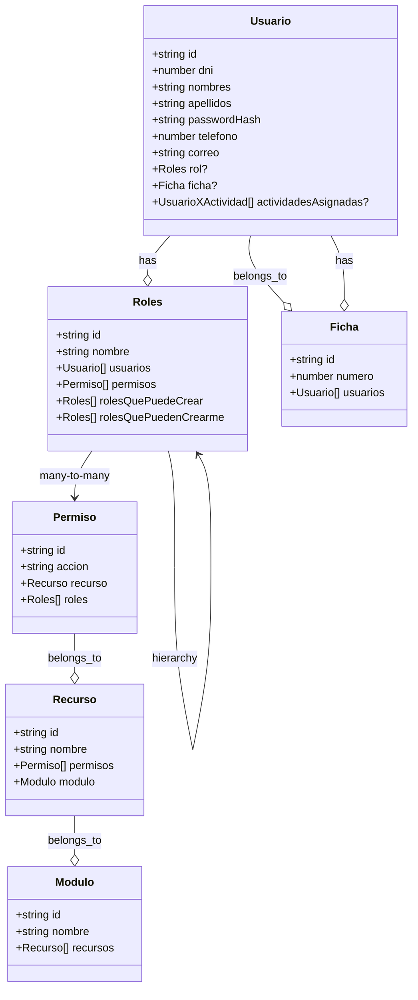

Diagrama Gestión de Usuarios y Seguridad: Diagrama de clases para gestión de usuarios y permisos, cubriendo autenticación y autorización con entidades Usuario, Roles, Permiso, Recurso, Modulo, incluyendo relaciones de seguridad y jerarquía de roles.

### Diagrama de Clases - Gestión de Cultivos

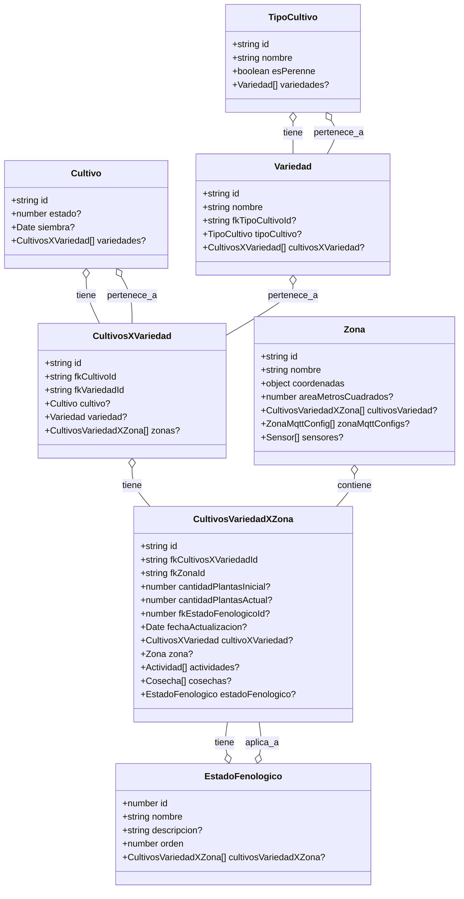

Diagrama Específico del Módulo de Cultivos: Diagrama de clases para la gestión de cultivos, incluyendo Cultivo, TipoCultivo, Variedad, CultivosXVariedad, Zona, CultivosVariedadXZona y EstadoFenologico, con relaciones de asociación entre cultivos, variedades y zonas.

### Diagrama de Clases - Gestión de Actividades

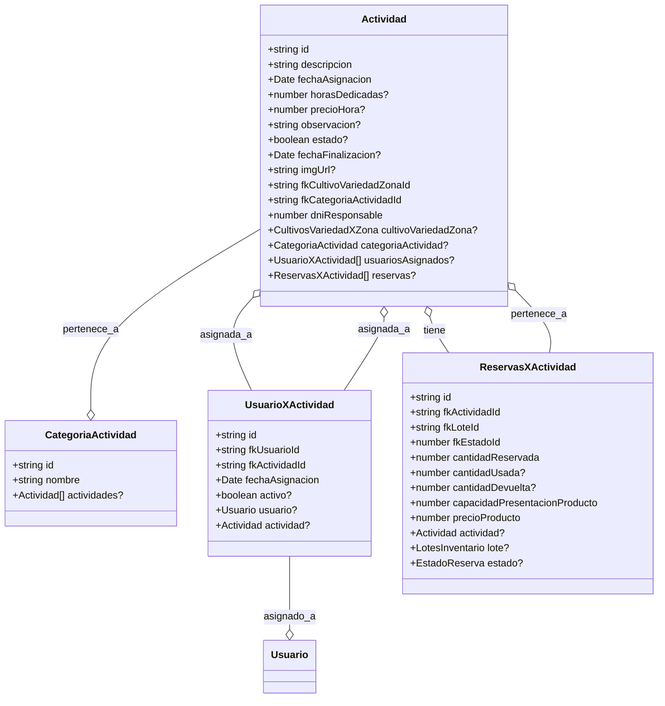

### Diagrama de Casos de Uso - Gestión de Actividades

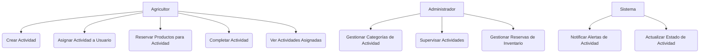

Diagrama de Casos de Uso para Gestión de Actividades: Diagrama que muestra los actores principales (Agricultor, Administrador, Sistema) y los casos de uso relacionados con la gestión de actividades agrícolas, incluyendo creación, asignación, reservas y supervisión.

### Diagrama de Clases - Gestión de Cosechas y Ventas

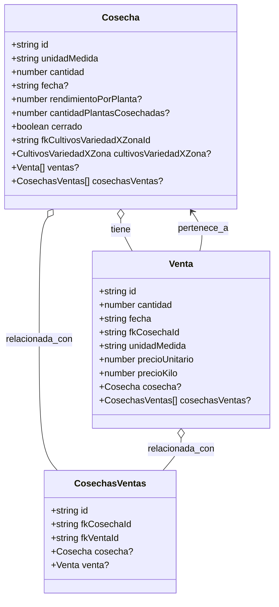

Diagrama Ventas, Finanzas: Diagrama de clases para gestión de cosechas y ventas, con entidades Cosecha, Venta y CosechasVentas, mostrando relaciones entre cosechas producidas y ventas realizadas.

### Diagrama de Clases - Sistema de Sensores y Mediciones

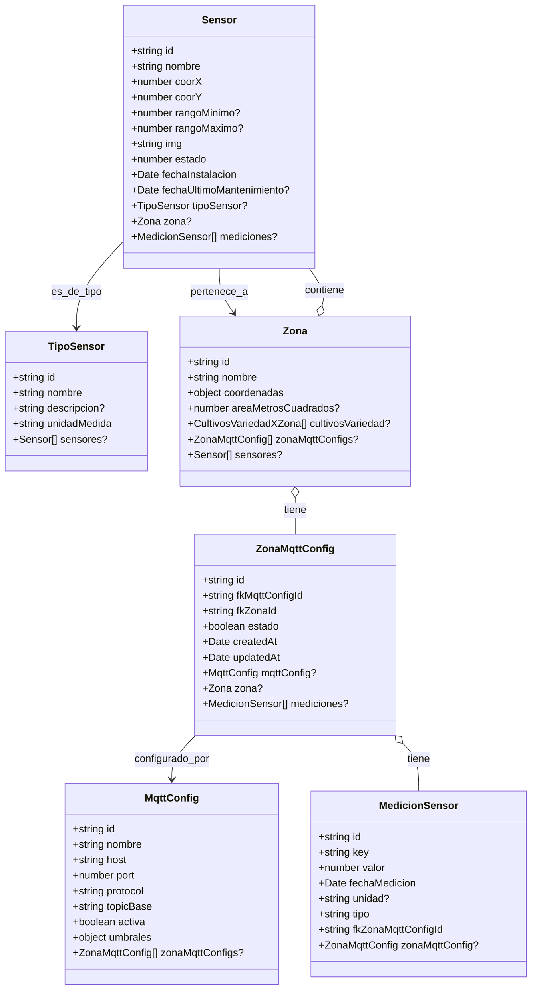

Diagrama Sistema IoT y Monitoreo: Diagrama de clases para el sistema de sensores y mediciones IoT, con entidades Sensor, TipoSensor, Zona, ZonaMqttConfig, MqttConfig y MedicionSensor, mostrando conexiones para monitoreo y configuración MQTT.

### Diagrama de Clases - Gestión de Inventario

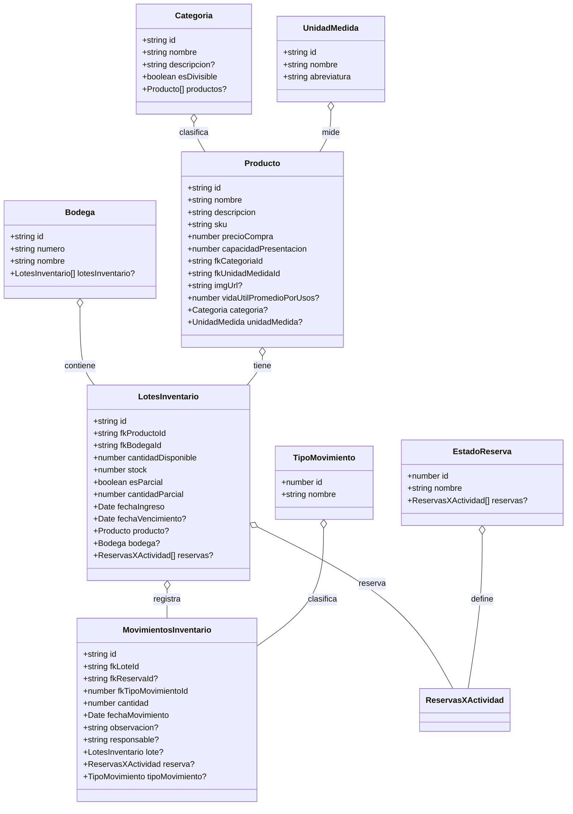

Diagrama Inventario y Actividades: Diagramas de clases para gestión de inventario y actividades, incluyendo Bodega, Categoria, Producto, LotesInventario, MovimientosInventario, Actividad, UsuarioXActividad y ReservasXActividad, con relaciones de reservas y movimientos.

### Diagrama de Clases - Gestión de Plagas y Enfermedades (EPA)

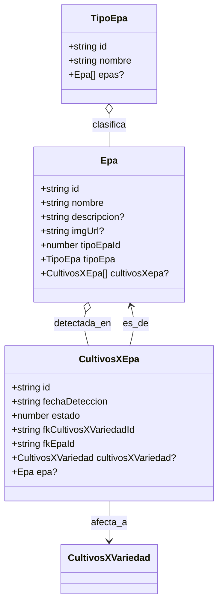

### Diagrama de Flujo - Proceso de Autenticación

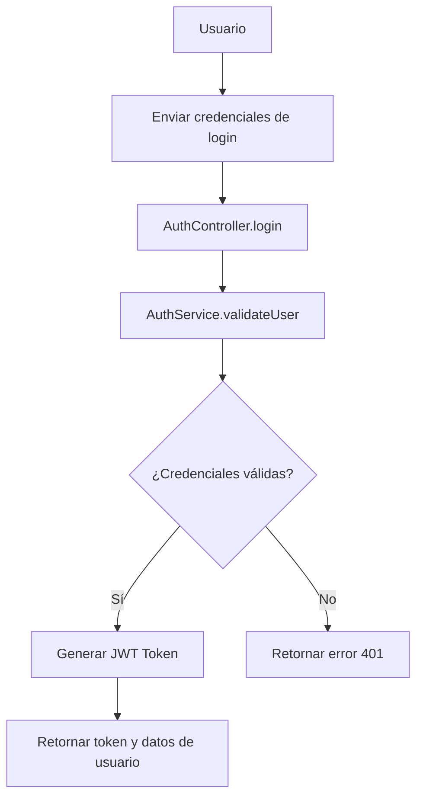

### Diagrama de Flujo - Proceso de Datos de Sensores

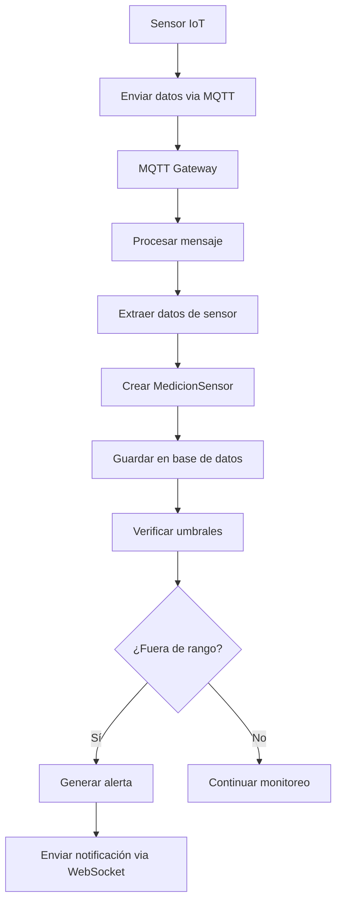
### Diagrama ER Completo - Estructura de la Base de Datos

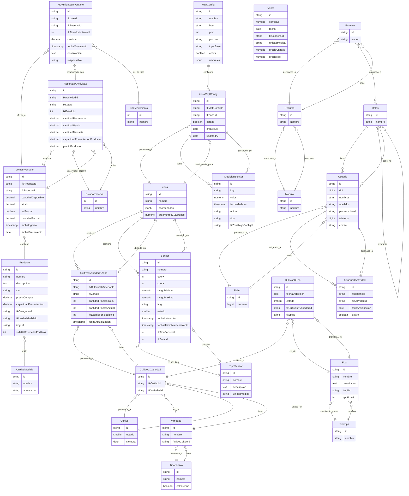

Diagrama ER Completo - Estructura de la Base de Datos: Diagrama ER completo de la estructura de la base de datos, incluyendo todas las entidades como Usuario, Roles, Cultivo, Sensor, Producto, etc., con sus atributos y relaciones detalladas.

### Diagrama General de Arquitectura

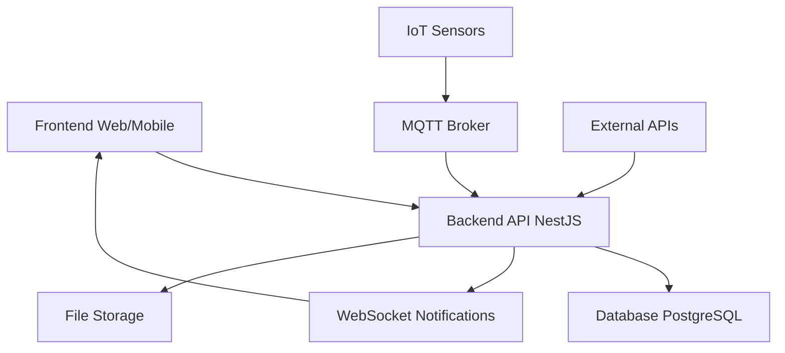

Diagrama General de Arquitectura: Muestra la arquitectura general del sistema AgroTic, incluyendo frontend web/mobile, backend API en NestJS, base de datos PostgreSQL, sensores IoT conectados via MQTT, notificaciones WebSocket, almacenamiento de archivos y APIs externas.

### Diagrama ER Simplificado en Entidades

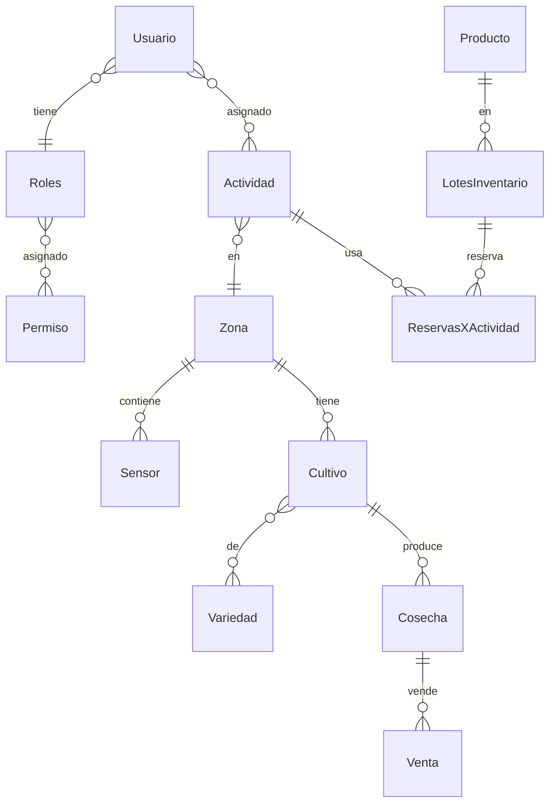

Diagrama ER Simplificado en Entidades: Representa las entidades principales y sus relaciones simplificadas, incluyendo usuarios con roles y permisos, actividades asignadas a zonas con sensores y cultivos, variedades de cultivos, cosechas y ventas, productos en lotes de inventario con reservas para actividades.

### Diagrama Específico del Módulo de Lotes (Zonas)

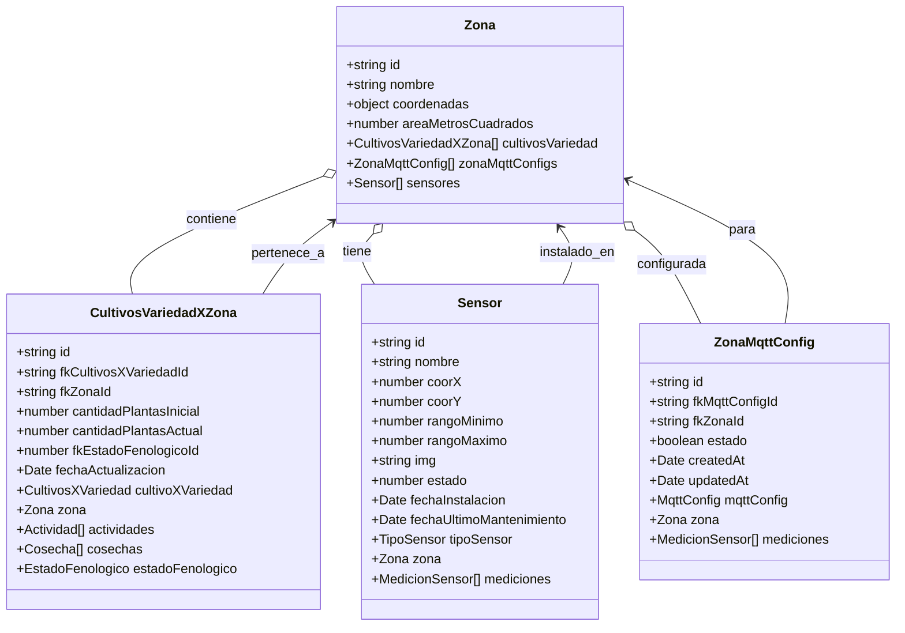

Diagrama Específico del Módulo de Lotes (Zonas): Diagrama de clases específico para el módulo de lotes (zonas), mostrando Zona con sus cultivos, sensores y configuraciones MQTT, incluyendo CultivosVariedadXZona, Sensor y ZonaMqttConfig.

### Diagrama de Secuencia - Flujo Típico de Operación

```mermaid
sequenceDiagram
    participant U as Usuario
    participant A as AuthService
    participant C as CultivosService
    participant S as SensoresService
    participant I as InventarioService
    participant V as VentasService

    U->A: Login
    A-->U: JWT Token
    U->C: Crear Cultivo
    C-->U: Cultivo creado
    U->S: Monitorear Sensores
    S-->U: Datos en tiempo real
    U->I: Reservar Inventario para Actividad
    I-->U: Reserva
    ```
    
    Diagrama de Secuencia - Flujo Típico de Operación: Diagrama de secuencia que ilustra el flujo típico de operación, desde el login del usuario hasta la reserva de inventario para actividades, involucrando AuthService, CultivosService, SensoresService, InventarioService y VentasService.
    
    ## Resumen de Entidades y Relaciones Principales

Las entidades incluidas en el diagrama ER son: MqttConfig, ZonaMqttConfig, Permiso, Producto, Recurso, ReservasXActividad, Roles, Sensor, TipoCultivo, TipoSensor, TipoMovimiento, UnidadMedida, Usuario, UsuarioXActividad, Variedad, Venta, Zona, Cultivo, CultivosVariedadXZona, CultivosXEpa, CultivosXVariedad, Epa, EstadoReserva, Ficha, LotesInventario, MedicionSensor, Modulo, MovimientosInventario, TipoEpa.

Relaciones principales:
- **Usuarios y Roles**: Usuario pertenece a Roles, Roles tienen muchos Usuario. Roles tienen muchos Permiso a través de una relación muchos a muchos.
- **Permisos y Recursos**: Permiso pertenece a Recurso, Recurso pertenece a Modulo.
- **Cultivos**: Cultivo tiene muchos CultivosXVariedad, que conecta con Variedad y Zona a través de CultivosVariedadXZona.
- **Sensores**: Sensor pertenece a TipoSensor y Zona, Zona tiene ZonaMqttConfig que conecta con MqttConfig y tiene MedicionSensor.
- **Inventario**: Producto mide con UnidadMedida, LotesInventario contiene Producto, tiene ReservasXActividad y MovimientosInventario.
- **Actividades**: Usuario asignado a UsuarioXActividad, ReservasXActividad reserva LotesInventario.
- **EPA**: Epa clasificado por TipoEpa, detectado en CultivosXEpa que afecta CultivosXVariedad.
### Diagrama Sistema Agrícola y Producción

```mermaid
flowchart TD
    A[Planificación de Cultivo] --> B[Selección de Variedad]
    B --> C[Asignación a Zona]
    C --> D[Siembra]
    D --> E[Monitoreo IoT]
    E --> F[Actividades Agrícolas]
    F --> G[Detección de Plagas/Enfermedades]
    G --> H[Tratamientos]
    H --> I[Cosecha]
    I --> J[Almacenamiento/Inventario]
    J --> K[Ventas]
    K --> L[Análisis de Rendimiento]
    L --> A
    E --> M[Alertas en Tiempo Real]
    M --> F
```

Diagrama Sistema Agrícola y Producción: Flujograma del sistema agrícola y producción, desde planificación de cultivo hasta análisis de rendimiento, incluyendo siembra, monitoreo IoT, actividades agrícolas, detección de plagas, tratamientos, cosecha, inventario, ventas y alertas en tiempo real.