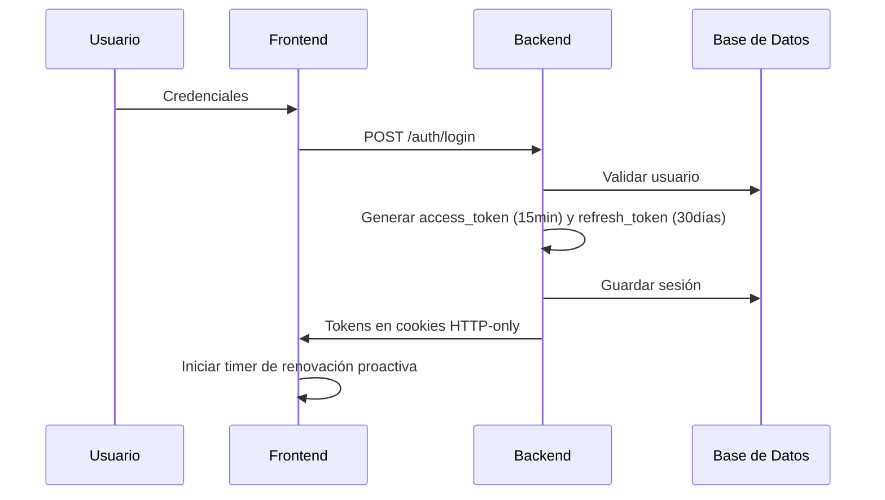
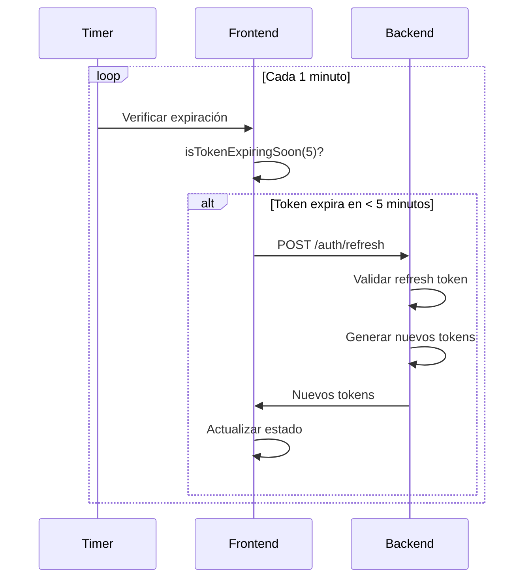
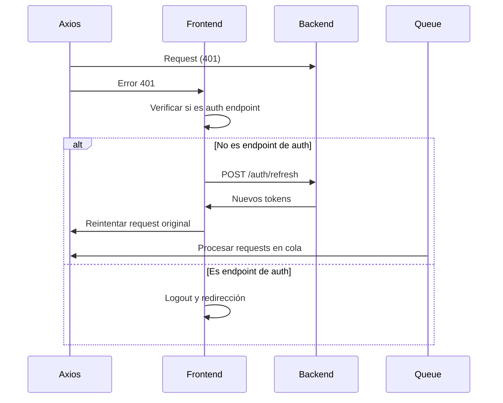

# Sistema de Renovación de Tokens - Refresh Token System

## Descripción General

El sistema de renovación de tokens implementado garantiza que las sesiones de usuario no expiren inesperadamente, proporcionando una experiencia de usuario fluida sin interrupciones.

## Características Principales

### 🔄 Renovación Proactiva
- **Detección de Expiración**: Monitorea automáticamente el tiempo de expiración de los tokens
- **Renovación Automática**: Refresca los tokens antes de que expiren (5 minutos antes)
- **Sin Interrupción**: El usuario no necesita hacer nada, todo ocurre en segundo plano

### 🛡️ Seguridad Robusta
- **Tokens HTTP-Only**: Los tokens se almacenan en cookies HTTP-only para mayor seguridad
- **Validación Dual**: Verificación tanto en base de datos como en Redis
- **Rate Limiting**: Previene demasiadas solicitudes de renovación en poco tiempo

### 🚀 Experiencia de Usuario Mejorada
- **Notificaciones Visuales**: Muestra cuando los tokens se están renovando
- **Manejo de Errores**: Gestión inteligente de errores con recuperación automática
- **Fallback Graceful**: Si la renovación falla, redirige suavemente al login

## Arquitectura del Sistema

### Backend (NestJS)

#### AuthController
```typescript
@Post('refresh')
async refreshToken(@Req() req: Request, @Res({ passthrough: true }) response: Response) {
  // Endpoint principal para renovación de tokens
}
```

#### AuthService
```typescript
async refreshToken(refreshToken: string) {
  // Lógica de validación y renovación de tokens
  // 1. Verifica el refresh token
  // 2. Valida la sesión en BD y Redis
  // 3. Genera nuevos tokens
  // 4. Actualiza la sesión
}
```

### Frontend (React)

#### PermissionContext
- **Gestión de Estado**: Maneja el estado de autenticación y permisos
- **Renovación Automática**: Inicia la renovación proactiva
- **Timer Management**: Gestiona los timers para verificación periódica

#### AuthService
```typescript
// Funciones principales
export const refreshToken = async (): Promise<void>
export const getAccessTokenExpiration = (): Date | null
export const isTokenExpiringSoon = (bufferMinutes: number = 5): boolean
```

## Flujo de Funcionamiento

### 1. Inicio de Sesión


### 2. Renovación Proactiva


### 3. Renovación por Error 401


## Configuración

### Variables de Entorno
```env
# Backend
JWT_SECRET=tu_jwt_secret_aqui
JWT_REFRESH_SECRET=tu_jwt_refresh_secret_aqui
JWT_EXPIRATION_TIME=15m
JWT_REFRESH_EXPIRATION_TIME=30d

# Frontend
VITE_API_URL=https://tu-api-url.com
```

### Integración en Componentes

#### 1. Agregar Notificación de Renovación
```tsx
import { TokenRefreshNotification } from '../components/molecules/TokenRefreshNotification';

function App() {
  return (
    <div>
      {/* Tu contenido de la app */}
      <TokenRefreshNotification />
    </div>
  );
}
```

#### 2. Usar Hook de Renovación
```tsx
import { useTokenRefresh } from '../hooks/useTokenRefresh';

function Dashboard() {
  const { 
    isRefreshing, 
    manualRefresh,
    shouldShowRefreshNotification 
  } = useTokenRefresh();

  const handleManualRefresh = async () => {
    const success = await manualRefresh();
    if (success) {
      console.log('Renovación manual exitosa');
    }
  };

  return (
    <div>
      {shouldShowRefreshNotification && (
        <div>🔄 Renovando sesión...</div>
      )}
      <button onClick={handleManualRefresh}>
        Renovar Sesión Manualmente
      </button>
    </div>
  );
}
```

## Monitoreo y Debugging

### Logs del Sistema

#### Frontend
```javascript
// Logs de renovación proactiva
console.log('PermissionContext: Token expiring soon, refreshing proactively');
console.log('PermissionContext: Starting refresh');
console.log('PermissionContext: refreshToken successful');
```

#### Backend
```javascript
// Logs de renovación
console.log('AuthService: Starting refresh for user:', userId);
console.log('AuthService: Session validated successfully');
console.log('AuthService: New tokens generated');
```

### Métricas Importantes

1. **Tasa de Renovación Exitosa**: % de renovaciones que succeeden
2. **Tiempo de Respuesta**: Tiempo promedio de renovación
3. **Frecuencia de Renovación**: Cuántas veces se renueva por sesión
4. **Errores de Renovación**: Tipos y frecuencia de errores

## Configuración Avanzada

### Personalizar Tiempos de Renovación
```typescript
// En authService.ts
export const isTokenExpiringSoon = (bufferMinutes: number = 5): boolean => {
  // Cambiar bufferMinutes según necesidades
  // 5 minutos = renovación muy frecuente
  // 10 minutos = renovación menos frecuente
}
```

### Deshabilitar Renovación Proactiva
```typescript
// En PermissionContext.tsx
const scheduleProactiveRefresh = useCallback(() => {
  // Comentar o remover esta función para deshabilitar
}, [refresh]);
```

## Solución de Problemas

### Problemas Comunes

#### 1. Tokens no se renuevan
**Síntomas**: Usuario es redirigido al login inesperadamente
**Solución**: 
- Verificar que `scheduleProactiveRefresh()` se esté llamando
- Revisar logs de backend para errores de validación
- Verificar configuración de cookies

#### 2. Renovación muy frecuente
**Síntomas**: Muchas solicitudes de renovación
**Solución**: 
- Aumentar el buffer en `isTokenExpiringSoon()`
- Verificar que el timer se esté limpiando correctamente
- Revisar la lógica de rate limiting

#### 3. Notificaciones no aparecen
**Síntomas**: Usuario no ve feedback visual
**Solución**:
- Verificar que `TokenRefreshNotification` esté importado en App
- Revisar CSS y z-index de la notificación
- Verificar estado de `isRefreshing`

## Próximas Mejoras

1. **Métricas en Tiempo Real**: Dashboard de monitoreo
2. **Configuración Dinámica**: Tiempos de renovación configurables por usuario
3. **Alertas Proactivas**: Notificaciones antes de que expire la sesión
4. **Analytics**: Análisis de patrones de uso y renovación

---

## Contacto y Soporte

Para soporte técnico o preguntas sobre el sistema de renovación:
- Revisar logs en consola del navegador
- Verificar configuración de backend
- Consultar documentación de NestJS y React